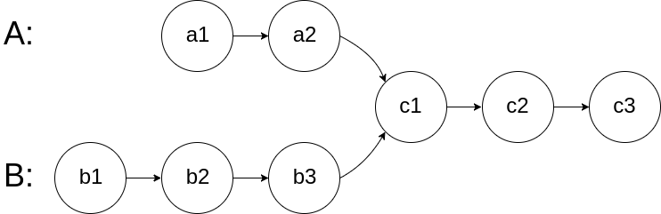

# 160. Intersection of Two Linked Lists

### Description

Given the heads of two singly linked-lists headA and headB, return the node at which the two lists intersect. If the two linked lists have no intersection at all, return null.

For example, the following two linked lists begin to intersect at node c1:



The test cases are generated such that there are no cycles anywhere in the entire linked structure.

Note that the linked lists must retain their original structure after the function returns.

Custom Judge:

The inputs to the judge are given as follows (your program is not given these inputs):

- intersectVal - The value of the node where the intersection occurs. This is 0 if there is no intersected node.
- listA - The first linked list.
- listB - The second linked list.
- skipA - The number of nodes to skip ahead in listA (starting from the head) to get to the intersected node.
- skipB - The number of nodes to skip ahead in listB (starting from the head) to get to the intersected node.
The judge will then create the linked structure based on these inputs and pass the two heads, headA and headB to your program. If you correctly return the intersected node, then your solution will be accepted.

### Solution

假设链A比链B长，两条链同时开始遍历。当链B到达末尾时，链A还需要走的距离，就是链A较长的部分。
将该步数记录下来，第二次遍历时链A先走。当两条链指针相同时，即为交叉点。

> 你也可以将链A完全记录下来，然后遍历B，第一个能找到的指针即为交叉点

### Implementation

###### c++

```c++
class Solution {
public:
    ListNode *getIntersectionNode(ListNode *headA, ListNode *headB) {
        if (!headA || !headB) return nullptr;

        int lenA = 0, lenB = 0;
        ListNode *currA = headA, *currB = headB;
        while (currA) {
            lenA++;
            currA = currA->next;
        }
        while (currB) {
            lenB++;
            currB = currB->next;
        }

        currA = headA;
        currB = headB;
        if (lenA > lenB) {
            int diff = lenA - lenB;
            while (diff--) currA = currA->next;
        } else {
            int diff = lenB - lenA;
            while (diff--) currB = currB->next;
        }

        while (currA && currB) {
            if (currA == currB) return currA; 
            currA = currA->next;
            currB = currB->next;
        }

        return nullptr; 
    }
};
```
