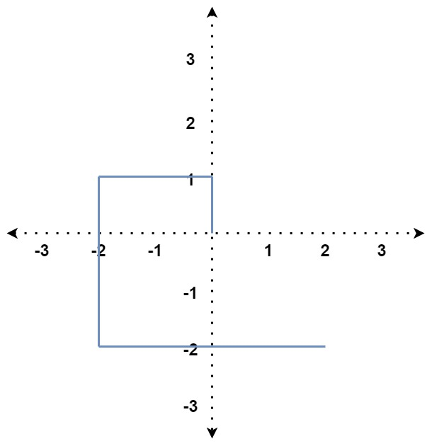

# 335. Self Crossing

### Description

You are given an array of integers distance.

You start at the point (0, 0) on an X-Y plane, and you move distance[0] meters to the north, then distance[1] meters to the west, distance[2] meters to the south, distance[3] meters to the east, and so on. In other words, after each move, your direction changes counter-clockwise.

Return true if your path crosses itself or false if it does not.

### Example 

###### Example I

> Input: distance = [2,1,1,2]
> Output: true
> Explanation: The path crosses itself at the point (0, 1).

###### Example II

> Input: distance = [1,2,3,4]
> Output: false
> Explanation: The path does not cross itself at any point.

###### Example III

> Input: distance = [1,1,1,2,1]
> Output: true
> Explanation: The path crosses itself at the point (0, 0).

### Solution

我们要判断的其实只有一下三种情况：

1. 当节点数量大于4的时候

> distance[i] >= distance[i-2] && distance[i-1] <= distance[i-3]

2. 当节点数量大于5的时候

> distance[i-1] == distance[i-3] && distance[i] + distance[i-4] >= distance[i-2]

3. 当节点数量大于6的时候

>    distance[i-2] >= distance[i-4] && distance[i] + distance[i-4] >= distance[i-2] 
> && distance[i-1] <= distance[i-3] && distance[i-1] + distance[i-5] >= distance[i-3]

