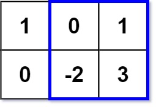

# 363. Max Sum of Rectangle No Larger Than K

### Description

Given an m x n matrix matrix and an integer k, return the max sum of a rectangle in the matrix such that its sum is no larger than k.

It is guaranteed that there will be a rectangle with a sum no larger than k.

### Example 

###### Example I



> Input: matrix = [[1,0,1],[0,-2,3]], k = 2
> Output: 2
> Explanation: Because the sum of the blue rectangle [[0, 1], [-2, 3]] is 2, and 2 is the max number no larger than k (k = 2).

###### Example II

> Input: matrix = [[2,2,-1]], k = 3
> Output: 3

### Solution

题目描述的这么清晰直白，那当然是使用暴力了

```c++
class Solution {
public:
    int maxSumSubmatrix(vector<vector<int>>& matrix, int k) {
        vector<vector<int>> s(matrix.size() + 1, vector<int>(matrix[0].size() + 1, 0));
        for(int i = 0; i < matrix.size(); i++){
            for(int j = 0; j < matrix[0].size(); j++){
                s[i+1][j+1] = s[i][j+1] + s[i+1][j] - s[i][j] + matrix[i][j];
            }
        }
        int ans = INT_MIN;
        for(int i = 1; i <= matrix.size(); i++){
            for(int j = 1; j <= matrix[0].size(); j++){
                
                for(int ii = 0; ii < i; ii++){
                    for(int jj = 0; jj < j; jj++){
                        
                        int sum = s[i][j] - s[ii][j] - s[i][jj] + s[ii][jj];
                        if(sum <= k)ans = max(ans, sum);
                    }
                }
            }
        }

        return ans;
    }
};
```
