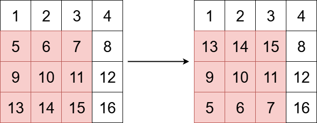
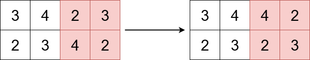

# 3643. Flip Square Submatrix Vertically

**Tags:** 

### Description

You are given an m x n integer matrix grid, and three integers x, y, and k.

The integers x and y represent the row and column indices of the top-left corner of a square submatrix and the integer k represents the size (side length) of the square submatrix.

Your task is to flip the submatrix by reversing the order of its rows vertically.

Return the updated matrix.

### Example

###### Example I



> Input: grid = [[1,2,3,4],[5,6,7,8],[9,10,11,12],[13,14,15,16]], x = 1, y = 0, k = 3
> Output: [[1,2,3,4],[13,14,15,8],[9,10,11,12],[5,6,7,16]]
> Explanation:
> The diagram above shows the grid before and after the transformation.

###### Example II



> Input: grid = [[3,4,2,3],[2,3,4,2]], x = 0, y = 2, k = 2
> Output: [[3,4,4,2],[2,3,2,3]]
> Explanation:
> The diagram above shows the grid before and after the transformation.

### Solution

按要求实现即可

```c++
class Solution {
public:
    vector<vector<int>> reverseSubmatrix(vector<vector<int>>& grid, int x, int y, int k) {
        for (int i = 0; i < k / 2; i++) {
            for (int j = 0; j < k; j++) {
                int ci = x + i, cj = y + j;
                int t = grid[ci][cj];
                grid[ci][cj] = grid[x + k - 1 - i][cj];
                grid[x + k - 1 - i][cj] = t;
            }
        }
        return grid;
    }
};
```
