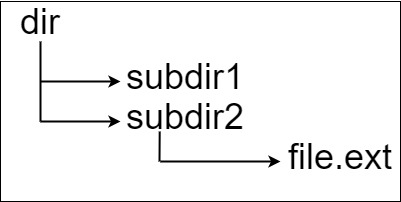

# 388. Longest Absolute File Path

### Description

Suppose we have a file system that stores both files and directories. An example of one system is represented in the following picture:


Here, we have dir as the only directory in the root. dir contains two subdirectories, subdir1 and subdir2. subdir1 contains a file file1.ext and subdirectory subsubdir1. subdir2 contains a subdirectory subsubdir2, which contains a file file2.ext.

In text form, it looks like this (with ⟶ representing the tab character):

> dir
> ⟶ subdir1
> ⟶ ⟶ file1.ext
> ⟶ ⟶ subsubdir1
> ⟶ subdir2
> ⟶ ⟶ subsubdir2
> ⟶ ⟶ ⟶ file2.ext

If we were to write this representation in code, it will look like this: "dir\n\tsubdir1\n\t\tfile1.ext\n\t\tsubsubdir1\n\tsubdir2\n\t\tsubsubdir2\n\t\t\tfile2.ext". Note that the '\n' and '\t' are the new-line and tab characters.

Every file and directory has a unique absolute path in the file system, which is the order of directories that must be opened to reach the file/directory itself, all concatenated by '/'s. Using the above example, the absolute path to file2.ext is "dir/subdir2/subsubdir2/file2.ext". Each directory name consists of letters, digits, and/or spaces. Each file name is of the form name.extension, where name and extension consist of letters, digits, and/or spaces.

Given a string input representing the file system in the explained format, return the length of the longest absolute path to a file in the abstracted file system. If there is no file in the system, return 0.

Note that the testcases are generated such that the file system is valid and no file or directory name has length 0.

### Example 

###### Example I



> Input: input = "dir\n\tsubdir1\n\tsubdir2\n\t\tfile.ext"
> Output: 20
> Explanation: We have only one file, and the absolute path is "dir/subdir2/file.ext" of length 20.

###### Example II


> Input: input = "dir\n\tsubdir1\n\t\tfile1.ext\n\t\tsubsubdir1\n\tsubdir2\n\t\tsubsubdir2\n\t\t\tfile2.ext"
> Output: 32
> Explanation: We have two files:
> "dir/subdir1/file1.ext" of length 21
> "dir/subdir2/subsubdir2/file2.ext" of length 32.
> We return 32 since it is the longest absolute path to a file.

###### Example III

> Input: input = "a"
> Output: 0
> Explanation: We do not have any files, just a single directory named "a".

### Solution

以\n为分割标志，用\t指示层数，遍历记录每一层文件的长度，更新文件总长度为当前文件名长度加上一层文件长度。
当为文件名时，总长度为当前文件名长度加层数（"\"）。

> 以第二个例子为说明，当我们遍历到subsubdir2时，第一层长度的值已由subdir2覆盖subdir1，所以我们可以直接取用。

```c++
class Solution {
public:
    int lengthLongestPath(string input) {
        unordered_map<int, int> depthLengthMap;
        depthLengthMap[-1] = 0;
        int an = 0;

        int i = 0;
        while (i < input.length()) {
            int depth = 0;
            while (i < input.length() && input[i] == '\t') {
                depth++; i++;
            }

            int start = i;
            bool isFile = false;
            while (i < input.length() && input[i] != '\n') {
                if (input[i] == '.') isFile = true;
                i++;
            }

            int len = i - start;
            string name = input.substr(start, len);
            depthLengthMap[depth] = depthLengthMap[depth - 1] + len;
            if (isFile) an = max(an, depthLengthMap[depth] + depth);

            i++;
        }
        return an;
    }
};
```
