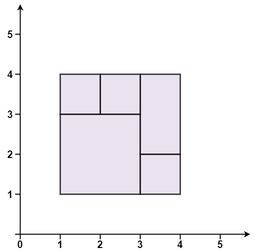
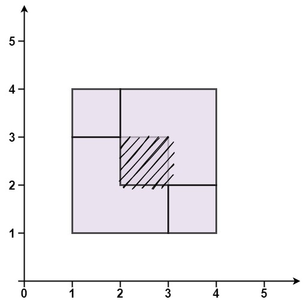

# 391. Perfect Rectangle

### Description

Given an array rectangles where rectangles[i] = [xi, yi, ai, bi] represents an axis-aligned rectangle. The bottom-left point of the rectangle is (xi, yi) and the top-right point of it is (ai, bi).

Return true if all the rectangles together form an exact cover of a rectangular region.

### Example 

###### Example I



> Input: rectangles = [[1,1,3,3],[3,1,4,2],[3,2,4,4],[1,3,2,4],[2,3,3,4]]
> Output: true
> Explanation: All 5 rectangles together form an exact cover of a rectangular region.

###### Example II


> Input: rectangles = [[1,1,2,3],[1,3,2,4],[3,1,4,2],[3,2,4,4]]
> Output: false
> Explanation: Because there is a gap between the two rectangular regions.

###### Example III



> Input: rectangles = [[1,1,3,3],[3,1,4,2],[1,3,2,4],[2,2,4,4]]
> Output: false
> Explanation: Because two of the rectangles overlap with each other.

### Solution

精确覆盖意味着：

矩形区域中不能有空缺，即矩形区域的面积等于所有矩形的面积之和；
矩形区域中不能有相交区域。
我们需要一个统计量来判定是否存在相交区域。由于精确覆盖意味着矩形的边和顶点会重合在一起，我们不妨统计每个矩形顶点的出现次数。同一个位置至多只能存在四个顶点，在满足该条件的前提下，如果矩形区域中有相交区域，这要么导致矩形区域四角的顶点出现不止一次，要么导致非四角的顶点存在出现一次或三次的顶点；

因此要满足精确覆盖，除了要满足矩形区域的面积等于所有矩形的面积之和，还要满足矩形区域四角的顶点只能出现一次，且其余顶点的出现次数只能是两次或四次。

在代码实现时，我们可以遍历矩形数组，计算矩形区域四个顶点的位置，以及矩形面积之和，并用哈希表统计每个矩形的顶点的出现次数。遍历完成后，检查矩形区域的面积是否等于所有矩形的面积之和，以及每个顶点的出现次数是否满足上述要求。

```c++
class Solution {
public:
    bool isRectangleCover(vector<vector<int>>& rectangles) {
        using LL = long long;
        int min_x = INT_MAX, min_y = INT_MAX;
        int max_x = INT_MIN, max_y = INT_MIN;
        LL actual_area = 0;
        set<pair<int, int>> corners;

        for (const auto& rect : rectangles) {
            int x1 = rect[0], y1 = rect[1], x2 = rect[2], y2 = rect[3];
            min_x = min(min_x, x1);
            min_y = min(min_y, y1);
            max_x = max(max_x, x2);
            max_y = max(max_y, y2);
            actual_area += (LL)(x2 - x1) * (y2 - y1);

            pair<int,int> p1 = {x1, y1}, p2 = {x1, y2};
            pair<int,int> p3 = {x2, y1}, p4 = {x2, y2};

            for (auto& p : {p1, p2, p3, p4}) {
                if (!corners.insert(p).second) {
                    corners.erase(p); 
                }
            }
        }

        LL expected_area = (LL)(max_x - min_x) * (max_y - min_y);
        if (actual_area != expected_area) return false;

        if (corners.size() != 4) return false;
        if (!corners.count({min_x, min_y})) return false;
        if (!corners.count({min_x, max_y})) return false;
        if (!corners.count({max_x, min_y})) return false;
        if (!corners.count({max_x, max_y})) return false;

        return true;
    }
};
```
