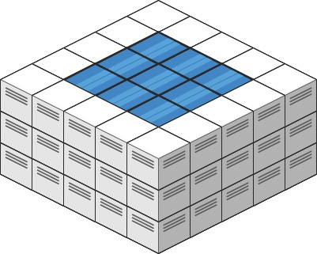

# 407. Trapping Rain Water II

### Description

Given an m x n integer matrix heightMap representing the height of each unit cell in a 2D elevation map, return the volume of water it can trap after raining.

### Example 

###### Example I


> Input: heightMap = [[1,4,3,1,3,2],[3,2,1,3,2,4],[2,3,3,2,3,1]]
> Output: 4
> Explanation: After the rain, water is trapped between the blocks.
> We have two small ponds 1 and 3 units trapped.
> The total volume of water trapped is 4.

###### Example II



> Input: heightMap = [[3,3,3,3,3],[3,2,2,2,3],[3,2,1,2,3],[3,2,2,2,3],[3,3,3,3,3]]
> Output: 10

### Solution

我一开始的想法是采用接雨水第一题的方式，遍历矩阵，获得每个格子在四个维度上的最高值，然后计算可以接的水的量。

但这个二维的世界中，雨水的量不止与这四个值有关（你能想象边界高度全是1，边界中间来个8，于是这个水桶中突兀的出现了一个水柱吗？）。

所以，我们要采用的方式是最小堆和广度优先搜索：将边界的值全部放入堆中，取最小的一个开始向周围遍历。

- 如果遍历到的值比取出的值小，那么计算可以积累的水的数量，将接水后的高度放入堆中。
- 如果遍历到的值比取出的值大，那么直接将这个较大的值放入到堆中。

```c++
#include <vector>
#include <queue>
#include <algorithm>

using namespace std;

class Solution {
public:
    int trapRainWater(vector<vector<int>>& heightMap) {
        if (heightMap.empty() || heightMap[0].empty()) return 0;

        int m = heightMap.size();
        int n = heightMap[0].size();

        using Cell = tuple<int, int, int>;
        priority_queue<Cell, vector<Cell>, greater<Cell>> minHeap;

        vector<vector<bool>> visited(m, vector<bool>(n, false));

        for (int i = 0; i < m; i++) {
            minHeap.emplace(heightMap[i][0], i, 0);
            minHeap.emplace(heightMap[i][n-1], i, n-1);
            visited[i][0] = true;
            visited[i][n-1] = true;
        }
        for (int j = 1; j < n - 1; j++) {
            minHeap.emplace(heightMap[0][j], 0, j);
            minHeap.emplace(heightMap[m-1][j], m-1, j);
            visited[0][j] = true;
            visited[m-1][j] = true;
        }

        int res = 0;
        int dirs[4][2] = {{1,0},{-1,0},{0,1},{0,-1}};

        while (!minHeap.empty()) {
            auto [height, x, y] = minHeap.top();
            minHeap.pop();

            for (auto& d : dirs) {
                int nx = x + d[0];
                int ny = y + d[1];
                if (nx >= 0 && nx < m && ny >= 0 && ny < n && !visited[nx][ny]) {
                    visited[nx][ny] = true;
                    res += max(0, height - heightMap[nx][ny]);
                    minHeap.emplace(max(height, heightMap[nx][ny]), nx, ny);
                }
            }
        }

        return res;
    }
};
```
