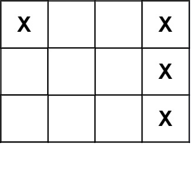

# 419. Battleships in a Board

### Description

Given an m x n matrix board where each cell is a battleship 'X' or empty '.', return the number of the battleships on board.

Battleships can only be placed horizontally or vertically on board. In other words, they can only be made of the shape 1 x k (1 row, k columns) or k x 1 (k rows, 1 column), where k can be of any size. At least one horizontal or vertical cell separates between two battleships (i.e., there are no adjacent battleships).

### Example 

###### Example I



> Input: board = [["X",".",".","X"],[".",".",".","X"],[".",".",".","X"]]
> Output: 2

###### Example II

> Input: board = [["."]]
> Output: 0

### Solution

遍历，每次遇到符合条件的时候，优先将整个battleship标记为已访问

```c++
class Solution {
public:
    int countBattleships(vector<vector<char>>& board) {
        int n = board.size();
        int m = board[0].size();
        vector<vector<bool>> visited(n, vector<bool>(m, false));

        int an = 0;
        for (int i = 0; i < n; i++) {
            for (int j = 0; j < m; j++) {
                if (!visited[i][j]) {
                    visited[i][j] = true;
                    if (board[i][j] == 'X') {
                        an++;
                        mark(visited, board, i, j, n, m);
                    }
                }
            }
        }
        return an;
    }

private:
    void mark(vector<vector<bool>>& visited, vector<vector<char>>& board, int i, int j, int n, int m) {
        visited[i][j] = true;
        if (i + 1 < n && board[i + 1][j] == 'X') mark(visited, board, i + 1, j, n, m);
        if (j + 1 < m && board[i][j + 1] == 'X') mark(visited, board, i, j + 1, n, m);
    }
};
```
