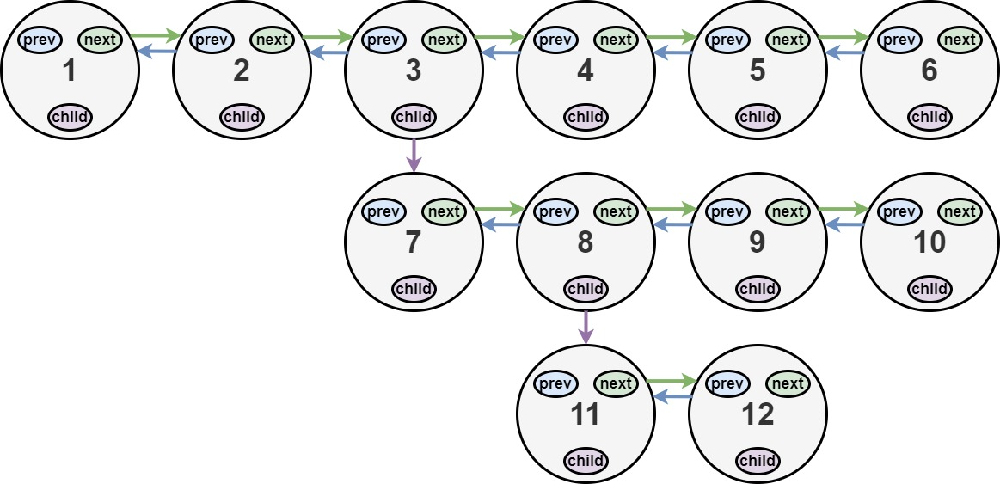

# 430. Flatten a Multilevel Doubly Linked List

### Description

You are given a doubly linked list, which contains nodes that have a next pointer, a previous pointer, and an additional child pointer. This child pointer may or may not point to a separate doubly linked list, also containing these special nodes. These child lists may have one or more children of their own, and so on, to produce a multilevel data structure as shown in the example below.

Given the head of the first level of the list, flatten the list so that all the nodes appear in a single-level, doubly linked list. Let curr be a node with a child list. The nodes in the child list should appear after curr and before curr.next in the flattened list.

Return the head of the flattened list. The nodes in the list must have all of their child pointers set to null.

### Example

###### Example I



> Input: head = [1,2,3,4,5,6,null,null,null,7,8,9,10,null,null,11,12]
> Output: [1,2,3,7,8,11,12,9,10,4,5,6]
> Explanation: The multilevel linked list in the input is shown.
> After flattening the multilevel linked list it becomes:


###### Example II


> Input: head = [1,2,null,3]
> Output: [1,3,2]
> Explanation: The multilevel linked list in the input is shown.
> After flattening the multilevel linked list it becomes:


###### Example III

> Input: head = []
> Output: []
> Explanation: There could be empty list in the input.

### Solution

遍历一遍，将所有的节点放在一个队列中，再挨个重新调整顺序。

```c++
/*
// Definition for a Node.
class Node {
public:
    int val;
    Node* prev;
    Node* next;
    Node* child;
};
*/

class Solution {
public:
    Node* flatten(Node* head) {
        vector<Node*> list;
        helper(head, list);

        for (int i = 0; i < list.size(); i++) {
            list[i]->prev = (i == 0) ? nullptr : list[i - 1];
            list[i]->next = (i == list.size() - 1) ? nullptr : list[i + 1];
            list[i]->child = nullptr;
        }
        return list.size() == 0 ? head : list[0];
    }

private:
    void helper(Node* curr, vector<Node*>& list) {
        if (curr == nullptr) return;

        list.push_back(curr);
        helper(curr->child, list);
        helper(curr->next, list);
    }
};
```

由于给出了两个指针，我们也可以不要队列存储，用两个指针代表当前目标子链表的开头和结尾（遍历以获取结尾），然后重新排列一下就好了。

```c++
/*
// Definition for a Node.
class Node {
public:
    int val;
    Node* prev;
    Node* next;
    Node* child;
};
*/

class Solution {
public:
    Node* flatten(Node* head) {
        Node* curr = head;
        while (curr) {
            if (curr->child) {
                Node* next = curr->next;
                Node* child = curr->child;
                curr->child = nullptr;

                curr->next = child;
                child->prev = curr;

                Node* tail = child;
                while (tail->next) {
                    tail = tail->next;
                }

                if (next) {
                    tail->next = next;
                    next->prev = tail;
                }
            }
            curr = curr->next;
        }
        return head;
    }
};
```
