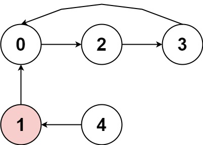

# 457. Circular Array Loop

### Description

You are playing a game involving a circular array of non-zero integers nums. Each nums[i] denotes the number of indices forward/backward you must move if you are located at index i:

- If nums[i] is positive, move nums[i] steps forward, and
- If nums[i] is negative, move nums[i] steps backward.
Since the array is circular, you may assume that moving forward from the last element puts you on the first element, and moving backwards from the first element puts you on the last element.

A cycle in the array consists of a sequence of indices seq of length k where:

- Following the movement rules above results in the repeating index sequence seq[0] -> seq[1] -> ... -> seq[k - 1] -> seq[0] -> ...
- Every nums[seq[j]] is either all positive or all negative.
- k > 1
Return true if there is a cycle in nums, or false otherwise.

### Example 

###### Example I



> Input: nums = [2,-1,1,2,2]
> Output: true
> Explanation: The graph shows how the indices are connected. White nodes are jumping forward, while red is jumping backward.
> We can see the cycle 0 --> 2 --> 3 --> 0 --> ..., and all of its nodes are white (jumping in the same direction).

###### Example II


> Input: nums = [-1,-2,-3,-4,-5,6]
> Output: false
> Explanation: The graph shows how the indices are connected. White nodes are jumping forward, while red is jumping backward.
> The only cycle is of size 1, so we return false.

###### Example III


> Input: nums = [1,-1,5,1,4]
> Output: true
> Explanation: The graph shows how the indices are connected. White nodes are jumping forward, while red is jumping backward.
> We can see the cycle 0 --> 1 --> 0 --> ..., and while it is of size > 1, it has a node jumping forward and a node jumping backward, so it is not a cycle.
> We can see the cycle 3 --> 4 --> 3 --> ..., and all of its nodes are white (jumping in the same direction).

### Solution

将数组中的节点表示为图，然后检测图是否存在环。

注意题目的特别要求：环路节点数目小于2的不算（节点如果指向自己，不构成链接）。一条路上所有的节点指向要么都为负，要么都为正（节点步数的正负要和节点指向的节点步数的正负一致）。

```c++
class Solution {
public:
    bool circularArrayLoop(vector<int>& nums) {
        int n = nums.size();
        if (n < 2) return false;

        vector<int> p(n, 0);
        for (int i = 0; i < n; i++) {
            int next = (i + nums[i]) % n;
            if (next < 0) next += n;
            bool same = (nums[i] > 0 && nums[next] > 0) || (nums[i] < 0 && nums[next] < 0);

            if (i != next && same) p[next]++;
        }

        vector<int> queue;
        for (int i = 0; i < n; i++) {
            if (p[i] == 0) queue.push_back(i);
        }

        int start = 0, last = queue.size();
        while (start != last) {
            for (int i = start; i < last; i++) {
                int c = queue[i];
                int s = (c + nums[c]) % n;
                if (s < 0) s+= n;
                bool same = (nums[c] > 0 && nums[s] > 0) || (nums[c] < 0 && nums[s] < 0);

                if (same) {
                    p[s]--;
                    if (p[s] == 0) queue.push_back(s);
                }
            }

            start = last;
            last = queue.size();
        }
        return queue.size() != n;
    }
};
```
