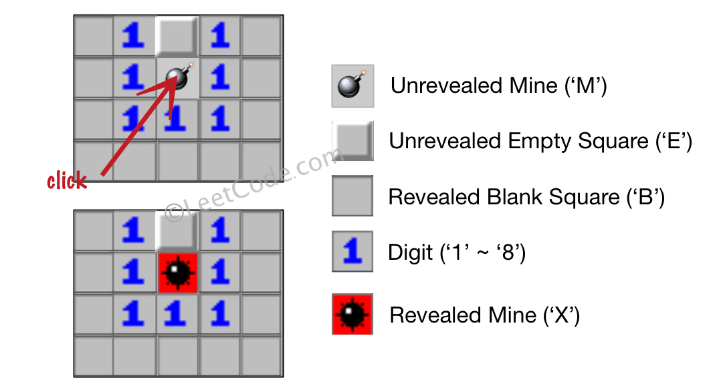

# 529. Minesweeper

**Tags:** BFS, DFS

### Description

Let's play the minesweeper game (Wikipedia, online game)!

You are given an m x n char matrix board representing the game board where:

- 'M' represents an unrevealed mine,
- 'E' represents an unrevealed empty square,
- 'B' represents a revealed blank square that has no adjacent mines (i.e., above, below, left, right, and all 4 diagonals),
digit ('1' to '8') represents how many mines are adjacent to this revealed square, and
- 'X' represents a revealed mine.
You are also given an integer array click where click = [clickr, clickc] represents the next click position among all the unrevealed squares ('M' or 'E').

Return the board after revealing this position according to the following rules:

1. If a mine 'M' is revealed, then the game is over. You should change it to 'X'.
2. If an empty square 'E' with no adjacent mines is revealed, then change it to a revealed blank 'B' and all of its adjacent unrevealed squares should be revealed recursively.
3. If an empty square 'E' with at least one adjacent mine is revealed, then change it to a digit ('1' to '8') representing the number of adjacent mines.
4. Return the board when no more squares will be revealed.

### Example

###### Example I


> Input: board = [["E","E","E","E","E"],["E","E","M","E","E"],["E","E","E","E","E"],["E","E","E","E","E"]], click = [3,0]
> Output: [["B","1","E","1","B"],["B","1","M","1","B"],["B","1","1","1","B"],["B","B","B","B","B"]]

###### Example II



> Input: board = [["B","1","E","1","B"],["B","1","M","1","B"],["B","1","1","1","B"],["B","B","B","B","B"]], click = [1,2]
> Output: [["B","1","E","1","B"],["B","1","X","1","B"],["B","1","1","1","B"],["B","B","B","B","B"]]

### Solution

按照规则要求实现即可，深度优先或者广度优先都可以

```c++
class Solution {
public:
    int dir_x[8] = {0, 1, 0, -1, 1, 1, -1, -1};
    int dir_y[8] = {1, 0, -1, 0, 1, -1, 1, -1};

    void dfs(vector<vector<char>>& board, int x, int y) {
        int cnt = 0;
        for (int i = 0; i < 8; ++i) {
            int tx = x + dir_x[i];
            int ty = y + dir_y[i];
            if (tx < 0 || tx >= board.size() || ty < 0 || ty >= board[0].size()) {
                continue;
            }
            cnt += board[tx][ty] == 'M';
        }
        if (cnt > 0) {
            board[x][y] = cnt + '0';
        } else {
            board[x][y] = 'B';
            for (int i = 0; i < 8; ++i) {
                int tx = x + dir_x[i];
                int ty = y + dir_y[i];
                if (tx < 0 || tx >= board.size() || ty < 0 || ty >= board[0].size() || board[tx][ty] != 'E') {
                    continue;
                }
                dfs(board, tx, ty);
            }
        }
    }

    vector<vector<char>> updateBoard(vector<vector<char>>& board, vector<int>& click) {
        int x = click[0], y = click[1];
        if (board[x][y] == 'M') {
            board[x][y] = 'X';
        } else {
            dfs(board, x, y);
        }
        return board;
    }
};
```
