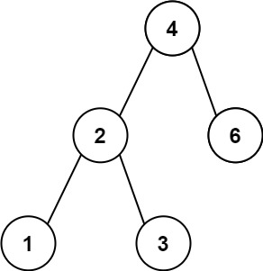

# 530. Minimum Absolute Difference in BST

**Tags:** DFS

### Description

Given the root of a Binary Search Tree (BST), return the minimum absolute difference between the values of any two different nodes in the tree.

### Example

###### Example I



> Input: root = [4,2,6,1,3]
> Output: 1

###### Example II


> Input: root = [1,0,48,null,null,12,49]
> Output: 1

### Solution

遍历

```c++
/**
 * Definition for a binary tree node.
 * struct TreeNode {
 *     int val;
 *     TreeNode *left;
 *     TreeNode *right;
 *     TreeNode() : val(0), left(nullptr), right(nullptr) {}
 *     TreeNode(int x) : val(x), left(nullptr), right(nullptr) {}
 *     TreeNode(int x, TreeNode *left, TreeNode *right) : val(x), left(left), right(right) {}
 * };
 */
class Solution {
public:
    int getMinimumDifference(TreeNode* root) {
        vector<int> val;
        dfs(root, val);

        int an = INT_MAX;
        for (int i = 1; i < val.size(); i++)
            an = min(an, val[i] - val[i - 1]);
        return an;
    }

private:
    void dfs(TreeNode* current, vector<int>& val) {
        if (current == nullptr) return;

        dfs(current->left, val);
        val.push_back(current->val);
        dfs(current->right, val);
    }
};
```
