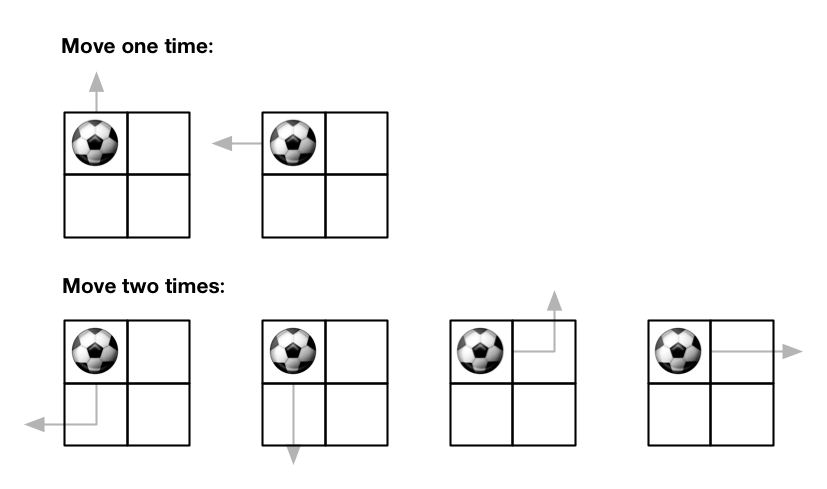
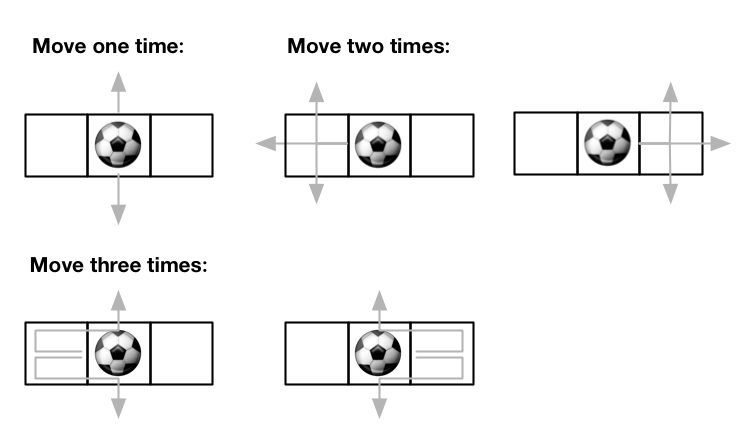

# 576. Out of Boundary Paths

**Tags:** Dynamic Programming

### Descripiton

There is an m x n grid with a ball. The ball is initially at the position [startRow, startColumn]. You are allowed to move the ball to one of the four adjacent cells in the grid (possibly out of the grid crossing the grid boundary). You can apply at most maxMove moves to the ball.

Given the five integers m, n, maxMove, startRow, startColumn, return the number of paths to move the ball out of the grid boundary. Since the answer can be very large, return it modulo 109 + 7.

### Example

###### Example I



> Input: m = 2, n = 2, maxMove = 2, startRow = 0, startColumn = 0
> Output: 6

###### Example II



> Input: m = 1, n = 3, maxMove = 3, startRow = 0, startColumn = 1
> Output: 12

### Solution

动态规划。从起点开始，考虑每个格子有多少种抵达方法。在超出边界的时候将抵达的方式累加到答案上。

```c++
class Solution {
public:
    int findPaths(int m, int n, int maxMove, int startRow, int startColumn) {
        vector<vector<vector<int>>> dp(maxMove + 1, vector<vector<int>>(m, vector<int>(n, 0)));
        vector<vector<int>> dir{{-1, 0}, {0, -1}, {1, 0}, {0, 1}};
        int MOD = 1000000007;
        int an = 0;
        dp[0][startRow][startColumn] = 1;

        for (int i = 0; i < maxMove; i++) {
            for (int j = 0; j < m; j++) {
                for (int k = 0; k < n; k++) {
                    int c = dp[i][j][k];
                    if (c > 0) {
                        for (vector<int>& d : dir) {
                            int x = j + d[0], y = k + d[1];
                            if (x >= 0 && x < m && y >= 0 && y < n) {
                                dp[i + 1][x][y] = (c + dp[i + 1][x][y]) % MOD;
                            } else {
                                an = (c + an) % MOD;
                            }
                        }
                    }
                }
            }
        }
        return an;
    }
};
```
